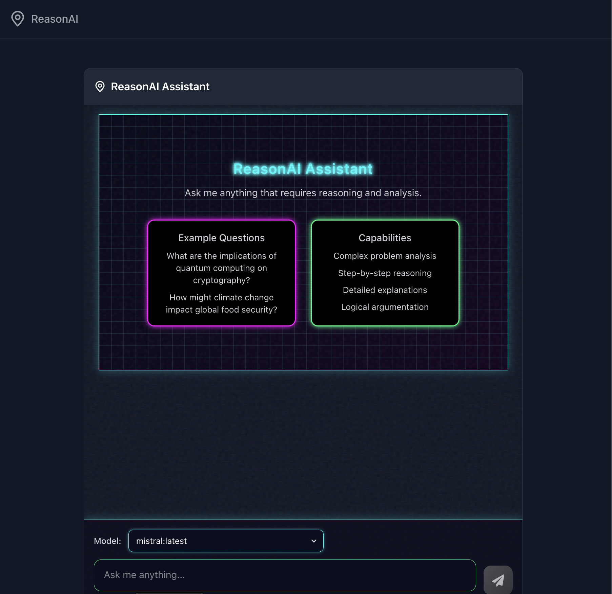

# 🧠 Next-Ollama-App

[](https://nextjs.org/)
[](https://ollama.com/)
[](https://react.dev/)
[](https://www.typescriptlang.org/)
[](https://tailwindcss.com/)

A powerful, privacy-focused AI agent framework built with Next.js and Ollama. This application autonomously decomposes complex tasks into manageable steps, executes them with transparent reasoning, and delivers comprehensive results—all while running locally on your machine.



## ✨ Features

- **📋 Task Decomposition**: Automatically breaks down user goals into logical, sequential steps
- **🤔 Transparent Reasoning**: Provides clear reasoning for each step of the process
- **⚡ Real-time Streaming**: Delivers progress updates as they happen
- **🔒 Privacy-Focused**: Runs 100% locally through Ollama—no API keys or data sharing
- **💾 Contextual Memory**: Maintains awareness of previous steps for coherent reasoning
- **🚀 Model Selection**: Flexibility to choose from any model available in your Ollama installation

## 📋 Table of Contents

- [Installation](#-installation)
- [Usage](#-usage)
- [Technical Architecture](#-technical-architecture)
- [Core Components](#-core-components)
- [API Endpoints](#-api-endpoints)
- [Customization](#-customization)
- [Development](#-development)
- [Contributing](#-contributing)
- [License](#-license)

## 🚀 Installation

### Prerequisites

- [Node.js](https://nodejs.org/) (v20 or later)
- [Ollama](https://ollama.com/) installed and running locally

### Setup

1. **Clone the repository**

```bash
git clone https://github.com/yourusername/next-ollama-app.git
cd next-ollama-app
```

2. **Install dependencies**

```bash
npm install
```

3. **Pull the necessary model with Ollama**

```bash
ollama pull mistral
```

> You can pull additional models if desired: `ollama pull llama3` or `ollama pull gemma:7b`

4. **Start the development server**

```bash
npm run dev
```

5. **Access the application**

Open [http://localhost:3000](http://localhost:3000) in your browser

## 🎮 Usage

### Executing a Task

1. **Define a goal**: Enter a specific task in the input field (Example: "Research and summarize recent advancements in quantum computing")

2. **Select a model**: Choose from available Ollama models in the dropdown

3. **Execute**: Click "Run Agent" to start the process

4. **Monitor progress**: 
   - Watch as the agent breaks down the task
   - See the reasoning for each step
   - View results as they're generated

5. **Review the final output**: A comprehensive, well-formatted result based on your goal

## 🏗️ Technical Architecture

The application uses a modern web architecture with these key components:

```
┌─────────────────────┐      ┌────────────────┐      ┌───────────────┐
│  Next.js Frontend   │◄────►│  Next.js API    │◄────►│ Ollama API    │
│  (React Components) │      │  (Agent Logic)  │      │ (Local Models)│
└─────────────────────┘      └────────────────┘      └───────────────┘
```

- **Frontend**: React components with streaming UI updates
- **Backend**: Next.js API routes implementing agent logic and Ollama communication
- **Processing**: Ollama running locally for LLM inference

## 🧩 Core Components

### Agent Class

The Agent class (`src/lib/agent.ts`) is the heart of the application:

```typescript
// Key components of the Agent class
export class Agent {
  // Initializes with user goal, model selection, and callbacks
  constructor(options: {
    goal: string;
    maxSteps?: number;
    onStepComplete?: StepCallback;
    model?: string;
  }) { ... }

  // Main execution function
  async execute(): Promise<AgentResult> {
    // 1. Analyze task and break into steps
    // 2. For each step:
    //    - Generate reasoning
    //    - Execute step
    //    - Provide output
    // 3. Create comprehensive final output
  }

  // Communication with Ollama
  private async callOllama(prompt: string): Promise<string> { ... }
}
```

### API Routes

The application has two main API endpoints:

1. **`/api/run-agent`**: Executes the agent with streaming responses
2. **`/api/models`**: Fetches available models from Ollama

### Streaming Implementation

The application uses the Web Streams API to deliver real-time updates:

```typescript
// Streaming in run-agent API route
const stream = new TransformStream();
const writer = stream.writable.getWriter();

// Function to send updates to the client
const sendUpdate = async (data: any) => {
  await writer.write(encoder.encode(JSON.stringify(data) + '\n'));
};

// Return stream to client
return new NextResponse(stream.readable, {
  headers: {
    'Content-Type': 'application/json',
    'Transfer-Encoding': 'chunked',
  },
});
```

## 📡 API Endpoints

### GET `/api/models`

Returns a list of all available models from your local Ollama installation.

**Response:**
```json
{
  "models": [
    {"name": "mistral:latest", "details": {...}},
    {"name": "llama3:latest", "details": {...}}
  ]
}
```

### POST `/api/run-agent`

Executes the agent with the specified goal and model.

**Request:**
```json
{
  "goal": "Research and summarize quantum computing advancements",
  "model": "mistral:latest"
}
```

**Streaming Response:**
```json
{"type": "log", "message": "🧠 Analyzing task: \"Research and...\""}
{"type": "log", "message": "📝 Step 1: Define quantum computing..."}
{"type": "log", "message": "🤔 Reasoning: I'll start by..."}
...
{"type": "result", "content": "# Quantum Computing Advancements\n\n..."}
```

## 🔧 Customization

### Modifying the Agent

The Agent class is designed to be extensible:

```typescript
// Example: Adding a custom task decomposition method
export class CustomAgent extends Agent {
  async customTaskAnalysis(goal: string) {
    // Implement your custom logic
    return [...customSteps];
  }
  
  async execute(): Promise<AgentResult> {
    // Override with custom implementation
    const steps = await this.customTaskAnalysis(this.goal);
    // Continue with execution...
  }
}
```

### Adding New Capabilities

You can extend the agent's capabilities by:

1. **Adding new step types**: Modify the Agent class to handle specialized steps
2. **Integrating external APIs**: Add API calls within the execution of specific steps
3. **Customizing prompting**: Refine the prompts used for task analysis and reasoning

## 💻 Development

### Running in Development Mode

```bash
npm run dev --turbopack
```

### Building for Production

```bash
npm run build
npm start
```

### Linting

```bash
npm run lint
```

## 👥 Contributing

Contributions are welcome! To contribute:

1. Fork the repository
2. Create a feature branch (`git checkout -b feature/amazing-feature`)
3. Commit your changes (`git commit -m 'Add some amazing feature'`)
4. Push to the branch (`git push origin feature/amazing-feature`)
5. Open a Pull Request

## 📄 License

This project is licensed under the MIT License - see the LICENSE file for details.

---

📌 **Note**: This application requires Ollama to be running locally. If you encounter connection issues, ensure Ollama is running with `ollama serve` and accessible at http://localhost:11434.
